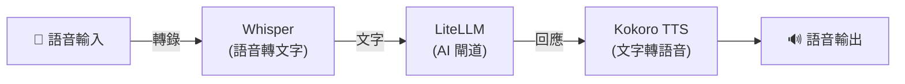

[English](README.md) | [简体中文](README-zh.md) | [繁體中文](README-zh-Hant.md) | [Русский](README-ru.md)

# Docker 上的 Kokoro 文字轉語音

[](https://github.com/hwdsl2/docker-tts/actions/workflows/main.yml) &nbsp;[](https://opensource.org/licenses/MIT)

一個用於執行 [Kokoro](https://github.com/hexgrad/kokoro) 文字轉語音伺服器的 Docker 映像。提供與 OpenAI 相容的音訊語音 API。基於 Debian（python:3.12-slim）。專為簡單、私密、自架伺服器而設計。

- 相容 OpenAI 的 `POST /v1/audio/speech` 端點 —— 已使用 OpenAI TTS API 的應用只需修改一行即可切換
- 20+ 種高品質語音：美式英語和英式英語，男女均有
- 同時支援 OpenAI 語音名稱（`alloy`、`nova`、`echo` 等）和原生 Kokoro 語音 ID（`af_heart`、`bm_george` 等）
- 音訊保留在您的伺服器上 —— 不向第三方傳送資料
- 支援所有主流輸出格式：`mp3`、`wav`、`flac`、`opus`、`aac`、`pcm`
- 離線/氣隙模式 —— 使用預快取模型無需存取網際網路（`TTS_LOCAL_ONLY`）
- 透過 [GitHub Actions](https://github.com/hwdsl2/docker-tts/actions/workflows/main.yml) 自動建置和發佈
- 透過 Docker 資料捲持久化模型快取
- 多架構：`linux/amd64`、`linux/arm64`

**另提供：**
- AI/音訊：[Whisper](https://github.com/hwdsl2/docker-whisper/blob/main/README-zh-Hant.md)、[LiteLLM](https://github.com/hwdsl2/docker-litellm/blob/main/README-zh-Hant.md)
- VPN：[WireGuard](https://github.com/hwdsl2/docker-wireguard/blob/main/README-zh-Hant.md)、[OpenVPN](https://github.com/hwdsl2/docker-openvpn/blob/main/README-zh-Hant.md)、[IPsec VPN](https://github.com/hwdsl2/docker-ipsec-vpn-server/blob/master/README-zh-Hant.md)、[Headscale](https://github.com/hwdsl2/docker-headscale/blob/main/README-zh-Hant.md)

**提示：** Whisper、LiteLLM 和 Kokoro TTS 可以[搭配使用](#與其他-ai-服務搭配使用)，在您自己的伺服器上搭建一套完整的語音 AI 系統。

## 快速開始

使用以下指令啟動 Kokoro TTS 伺服器：

```bash
docker run \
    --name tts \
    --restart=always \
    -v tts-data:/var/lib/tts \
    -p 8880:8880 \
    -d hwdsl2/tts-server
```

**注：** 如需面向網際網路的部署，**強烈建議**使用[反向代理](#使用反向代理)來新增 HTTPS。此時，還應將上述 `docker run` 指令中的 `-p 8880:8880` 替換為 `-p 127.0.0.1:8880:8880`，以防止從外部直接存取未加密連接埠。

**注：** 本映像檔由於使用 PyTorch 執行時，至少需要約 1 GB 可用記憶體。在總記憶體僅 1 GB 的伺服器上可能無法穩定運行。

Kokoro 模型（約 320 MB）將在首次啟動時自動下載並快取。查看日誌確認伺服器已就緒：

```bash
docker logs tts
```

看到「Kokoro TTS server is ready」後，即可合成您的第一個音訊檔案：

```bash
curl http://您的伺服器IP:8880/v1/audio/speech \
    -H "Content-Type: application/json" \
    -d '{"model":"tts-1","input":"你好，世界！","voice":"af_heart"}' \
    --output speech.mp3
```

## 系統需求

- 已安裝 Docker 的 Linux 伺服器（本機或雲端）
- 支援的架構：`amd64`（x86_64）、`arm64`（例如 Raspberry Pi 4/5、AWS Graviton）
- 最低可用記憶體：約 1 GB（模型約 320 MB；PyTorch 執行時需要額外記憶體）
- 首次下載模型需要網際網路存取（之後模型會快取在本機）。若使用預快取模型並設定 `TTS_LOCAL_ONLY=true` 則不需要。

對於面向網際網路的部署，請參閱[使用反向代理](#使用反向代理)以新增 HTTPS。

## 下載

從 [Docker Hub](https://hub.docker.com/r/hwdsl2/tts-server/) 取得受信任的建置：

```bash
docker pull hwdsl2/tts-server
```

也可從 [Quay.io](https://quay.io/repository/hwdsl2/tts-server) 下載：

```bash
docker pull quay.io/hwdsl2/tts-server
docker image tag quay.io/hwdsl2/tts-server hwdsl2/tts-server
```

支援平台：`linux/amd64` 和 `linux/arm64`。

## 環境變數

所有變數均為選填。若未設定，將自動使用安全的預設值。

此 Docker 映像使用以下變數，可在 `env` 檔案中宣告（參見[範例](tts.env.example)）：

| 變數 | 說明 | 預設值 |
|---|---|---|
| `TTS_VOICE` | 合成語音的預設音色。參見[可用語音](#可用語音)了解所有選項。支援 Kokoro 語音 ID（`af_heart`）或 OpenAI 別名（`alloy`）。 | `af_heart` |
| `TTS_SPEED` | 預設語速。範圍：`0.25`（最慢）到 `4.0`（最快）。 | `1.0` |
| `TTS_PORT` | API 的 HTTP 埠（1–65535）。 | `8880` |
| `TTS_LANG_CODE` | TTS 管線的語言/口音。`a` 為美式英語，`b` 為英式英語。 | `a` |
| `TTS_API_KEY` | 選填的 Bearer 權杖。設定後，所有 API 請求須包含 `Authorization: Bearer <key>`。 | *(未設定)* |
| `TTS_LOG_LEVEL` | 日誌等級：`DEBUG`、`INFO`、`WARNING`、`ERROR`、`CRITICAL`。 | `INFO` |
| `TTS_LOCAL_ONLY` | 設定為任意非空值（例如 `true`）時，停用所有 HuggingFace 模型下載。適用於離線或氣隙部署（需預快取模型）。 | *(未設定)* |

**注：** 在 `env` 檔案中，值可以用單引號括起來，例如 `VAR='value'`。`=` 兩側不要有空格。如果變更了 `TTS_PORT`，請相應更新 `docker run` 指令中的 `-p` 參數。

使用 `env` 檔案的範例：

```bash
cp tts.env.example tts.env
# 編輯 tts.env 後執行：
docker run \
    --name tts \
    --restart=always \
    -v tts-data:/var/lib/tts \
    -v ./tts.env:/tts.env:ro \
    -p 8880:8880 \
    -d hwdsl2/tts-server
```

`env` 檔案以綁定掛載方式傳入容器，每次重新啟動時自動生效，無需重新建立容器。

## 使用 docker-compose

```bash
cp tts.env.example tts.env
# 依需求編輯 tts.env，然後：
docker compose up -d
docker logs tts
```

## API 參考

該 API 與 [OpenAI 文字轉語音端點](https://platform.openai.com/docs/api-reference/audio/createSpeech)完全相容。任何已呼叫 `https://api.openai.com/v1/audio/speech` 的應用，只需設定以下環境變數即可切換到自架伺服器：

```
OPENAI_BASE_URL=http://您的伺服器IP:8880
```

### 合成語音

```
POST /v1/audio/speech
Content-Type: application/json
```

**請求主體：**

| 欄位 | 類型 | 是否必填 | 說明 |
|---|---|---|---|
| `model` | 字串 | ✅ | 傳入 `tts-1`、`tts-1-hd` 或 `kokoro`（均使用 Kokoro-82M）。 |
| `input` | 字串 | ✅ | 要合成的文字。最多 4096 個字元。 |
| `voice` | 字串 | ✅ | 使用的語音。參見[可用語音](#可用語音)。支援 Kokoro ID 或 OpenAI 別名。 |
| `response_format` | 字串 | — | 輸出格式。預設：`mp3`。選項：`mp3`、`opus`、`aac`、`flac`、`wav`、`pcm`。 |
| `speed` | 浮點數 | — | 語速。預設：`1.0`。範圍：`0.25`–`4.0`。 |

**範例：**

```bash
curl http://您的伺服器IP:8880/v1/audio/speech \
    -H "Content-Type: application/json" \
    -d '{"model":"tts-1","input":"敏捷的棕色狐狸跳過了懶惰的狗。","voice":"af_heart"}' \
    --output speech.mp3
```

**回應：** 帶有相應 `Content-Type` 標頭的二進位音訊資料。

### 互動式 API 文件

訪問以下網址可使用互動式 Swagger UI：

```
http://您的伺服器IP:8880/docs
```

## 可用語音

隨時使用 `tts_manage --listvoices` 查看完整清單：

```bash
docker exec tts tts_manage --listvoices
```

| 語音 ID | 口音 | 性別 | 風格 |
|---|---|---|---|
| `af_heart` | 美式 | 女聲 | 溫暖、自然 —— **預設** |
| `af_bella` | 美式 | 女聲 | 富有表現力 |
| `af_nova` | 美式 | 女聲 | 清晰 |
| `af_sky` | 美式 | 女聲 | 中性、多用途 |
| `af_sarah` | 美式 | 女聲 | 對話感強 |
| `af_nicole` | 美式 | 女聲 | 親切 |
| `am_adam` | 美式 | 男聲 | 低沉 |
| `am_michael` | 美式 | 男聲 | 清晰 |
| `am_echo` | 美式 | 男聲 | 中性 |
| `am_onyx` | 美式 | 男聲 | 醇厚 |
| `bf_emma` | 英式 | 女聲 | 清晰、專業 |
| `bf_isabella` | 英式 | 女聲 | 溫暖 |
| `bm_george` | 英式 | 男聲 | 權威 |
| `bm_lewis` | 英式 | 男聲 | 流暢 |

> **提示：** 英式語音（`bf_*`、`bm_*`）在設定 `TTS_LANG_CODE=b` 時效果最佳。

所有語音共用同一個模型檔案（約 320 MB）。切換語音時無需重新下載。

## 管理伺服器

在執行中的容器內使用 `tts_manage` 來檢查和管理伺服器。

**顯示伺服器資訊：**

```bash
docker exec tts tts_manage --showinfo
```

**列出可用語音：**

```bash
docker exec tts tts_manage --listvoices
```

## 使用反向代理

對於面向網際網路的部署，請在 TTS 伺服器前放置反向代理以處理 HTTPS 終止。

從反向代理存取 TTS 容器，使用以下地址之一：

- **`tts:8880`** —— 若反向代理作為容器執行在與 TTS 伺服器**相同的 Docker 網路**中。
- **`127.0.0.1:8880`** —— 若反向代理執行在**主機上**且埠 `8880` 已發佈。

面向公開網際網路時，請在 `env` 檔案中設定 `TTS_API_KEY`。

## 更新 Docker 映像

如需更新 Docker 映像和容器，首先[下載](#下載)最新版本：

```bash
docker pull hwdsl2/tts-server
```

如果映像已是最新版本，您將看到：

```
Status: Image is up to date for hwdsl2/tts-server:latest
```

否則將下載最新版本。刪除並重新建立容器：

```bash
docker rm -f tts
# 然後使用相同的資料捲和連接埠重新執行快速開始中的 docker run 指令。
```

您下載的模型將保留在 `tts-data` 資料捲中。

## 與其他 AI 服務搭配使用

[Whisper](https://github.com/hwdsl2/docker-whisper/blob/main/README-zh-Hant.md)、[LiteLLM](https://github.com/hwdsl2/docker-litellm/blob/main/README-zh-Hant.md) 和 [Kokoro TTS](https://github.com/hwdsl2/docker-tts/blob/main/README-zh-Hant.md) 映像檔可以組合使用，在您自己的伺服器上搭建一個完全私密的自託管語音 AI 助理，所有資料均不傳送給第三方。



- **[Whisper](https://github.com/hwdsl2/docker-whisper/blob/main/README-zh-Hant.md)** — 將語音音訊轉錄為文字（連接埠 `9000`）
- **[LiteLLM](https://github.com/hwdsl2/docker-litellm/blob/main/README-zh-Hant.md)** — 將文字傳送給大型語言模型並傳回回應（連接埠 `4000`）
- **[Kokoro TTS](https://github.com/hwdsl2/docker-tts/blob/main/README-zh-Hant.md)** — 將回應文字轉換為語音（連接埠 `8880`）

三個容器都執行後，您可以將它們的 API 串接使用：

```bash
# 第一步：將語音音訊轉錄為文字（Whisper）
TEXT=$(curl -s http://localhost:9000/v1/audio/transcriptions \
    -F file=@question.mp3 -F model=whisper-1 | jq -r .text)

# 第二步：將文字傳送給大型語言模型並取得回應（LiteLLM）
RESPONSE=$(curl -s http://localhost:4000/v1/chat/completions \
    -H "Authorization: Bearer <your-litellm-key>" \
    -H "Content-Type: application/json" \
    -d "{\"model\":\"gpt-4o\",\"messages\":[{\"role\":\"user\",\"content\":\"$TEXT\"}]}" \
    | jq -r '.choices[0].message.content')

# 第三步：將回應轉換為語音（Kokoro TTS）
curl -s http://localhost:8880/v1/audio/speech \
    -H "Content-Type: application/json" \
    -d "{\"model\":\"tts-1\",\"input\":\"$RESPONSE\",\"voice\":\"af_heart\"}" \
    --output response.mp3
```

## 授權條款

**注：** 預構建映像中包含的軟體元件（如 Kokoro 及其相依套件）均受各自版權持有者所選授權條款約束。使用預構建映像時，使用者有責任確保其使用方式符合映像內所有軟體的相關授權條款要求。

著作權所有 (C) 2026 Lin Song   
本作品採用 [MIT 授權條款](https://opensource.org/licenses/MIT)。

**Kokoro TTS** 版權歸 hexgrad 所有，依據 [Apache License 2.0](https://github.com/hexgrad/kokoro/blob/main/LICENSE) 分發。

本專案是 Kokoro 的獨立 Docker 封裝，與 hexgrad 或 OpenAI 無關聯、無背書。